## 1

input:

- text: image description
- temporal: steps
- spatial: position in x,y, phi
-

refresh rate:

- 5 degrees / 10 distance
- need to update images / lidars
- need to extract information
    - target identification
    - obstacles
    - steps

Assumptions:
- the robot knows its position (x,y,phi) in the environment
- the robot can identify the position (x,y) of the target when the robot sees the target in the image using the information of image and lidar.

scope:

 - Tasks: 
   - exploration with targets search in unknown environment
     - LLM for path planning
     - target identification and localization
     - build knowledge graph memory while exploring
   - find and approach targets in known environment (obstacle and target positions are known)
     - LLM for embodied question answering for actionable commands / waypoints
       - xxx located at (x,y) and move to (x,y)
     - pre-built knowledge graph memory, need to update the memory with new information

literature:
 - [ReMEmbR: Building and Reasoning Over Long-Horizon Spatio-Temporal Memory for Robots](https://arxiv.org/pdf/2409.13682)
 - [AriGraph: KG with episodic and semantic memory for Embodied QA](https://arxiv.org/pdf/2407.04363)

 - [GraphRAG under Fire](https://arxiv.org/pdf/2501.14050)

robot - position
robot - time
robot - image description

time - position - image description / spatial description
image description: found target at (x,y) / no target found

total targets: []
identified targets: []

visited targets: []
remaining targets: []

reliability

knowledge graph

## Spatio-Temporal graph for Robot Memory

```mermaid
classDiagram
    class RobotNode {
        +String id
        +Timestamp time
        +Position pose
        +Float orientation
        +SensorData observations
        +observeEnvironment()
        +updatePosition()
    }
    
    class SensorData {
        +String visual_description
        +Array lidar_distances
        +String lidar_description
        +processVisualInput()
        +processLidarData()
    }
    
    class WorldNode {
        +String id
        +String type
        +Position global_position
        +Timestamp first_seen
        +Timestamp last_seen
        +Float confidence
        +updatePosition()
        +updateConfidence()
    }
    
    class TemporalEdge {
        +String source_id
        +String target_id
        +Timestamp time
        +computeTransform()
    }
    
    class SpatialEdge {
        +String source_id
        +String target_id
        +RelativePosition relative_pos
        +Float confidence
        +updateRelation()
    }
    
    class Position {
        +Float x
        +Float y
        +Float z
    }
    
    class RelativePosition {
        +Float distance
        +Float bearing
        +Float elevation
    }

    RobotNode --> SensorData : contains
    RobotNode --> Position : has
    WorldNode --> Position : has
    RobotNode --> RobotNode : temporal_sequence
    RobotNode --> WorldNode : observes
    TemporalEdge --> RobotNode : connects
    SpatialEdge --> WorldNode : relates
    SpatialEdge --> RelativePosition : describes
```

